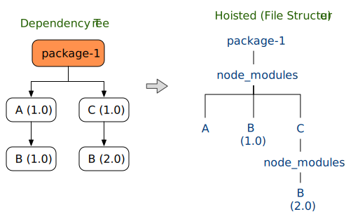
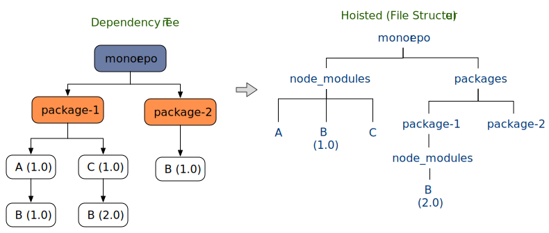
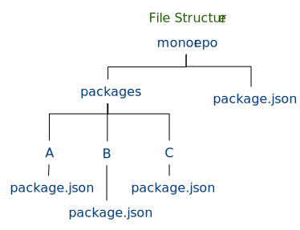
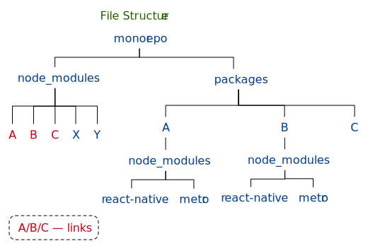

# nohoist for yarn workspaces

## What is the problem ?
To reduce redundancy, most package managers employ some kind of hoisting scheme to extract all the dependent modules into a centralized location. In a standalone project, it often means a flat "project/node_modules", with exception for conflicting version : 



Therefore, most module loaders/bundlers can locate module pretty efficiently by traversing down through the "node_modules" hierarchy in standalone projects  regardless hoisting scheme. 

Then comes the monorepo project, which introduces a new hierarchy structure that is not necessary linked by "node_modules" chain. In such project, modules could be scattered in multiple locations without predictable linking structure. For example, a monorepo project can declare its child projects as ["packages/package-1", "packages/package-2"]. 



Most node_modules crawlers built to traversing node_modules hierarchy would fail to find module "B@2.0" from project root "monorepo", or module "A@1.0" from "package-1". For this project to reliably find any module from anywhere, it needs to traverse at least 2 node_modules chains: "monorepo/node_modules" and "monorepo/packages/package-1/node_modules". In short, a monorepo project basically moves from the traditional single-chain model to mult-chain, and that breaks many existing module resolution systems.

There are many ways to address this from the library's perspective, such as multi-root, customizable module map, clever traversing scheme, among others... However 
1. not all the 3rd party libraries have the resource to adapt for monorepo environment
1. the weekest link problem: javascript is great thanks to the massive 3rd-party libraries. However, that also means the complex tool chain is only as strong as the weakest link. A single non-adapted package deep down the tool chain could render the whole tool useless. 
1. the bootstrap problems: for example, react-native has provided a way to configure multi-root through "rn-cli.config.js" to help bundler locating modules. But it won't help the bootstrap process like "react-native init" or "create-react-native-app", which has no access of any such tooling before the app is created/installed. Even if it does understand the monorepo project structure, all of its dependent scripts/modules, for example expo, will also need to act consistently for it to work.

It is frustrating when a solution worked for a standalone project only fell short in the monorepo environment. Ideally, the solution lies in addressing the underlying libraries as mentioned above, but the reality is far from perfect and we all know that our projects can't wait and life has to go on... So is there a simple yet universal mechanism to allow libraries working in monorepo environment even if they were originally written for standalone project? A solution that we, the library consumers, can do to workaround these incompatibility issues?

## What is "nohoist" ?

The answer is yes! It's conveniently called _"nohoist"_, which has also been demonstrated in other monorepo tools like [lerna](https://github.com/lerna/lerna/blob/master/doc/hoist.md).

A "nohoist" is basically a tooling option for monorepo projects that consume 3rd-party libraries not yet compatible with monorepo hoisting scheme. The idea is to disable the selected modules from the monorepo hoisting scheme (to the virtual root project) and place them in the actual (child) project instead, just like in a standalone project.

Since most 3rd-party libraries already worked in standalone project, the ability to simulate a standalone project within monorepo environment should be able to eliminate many incompatibility issues without requiring libraries to make any change. 


## When will it be available?

[#4979](https://github.com/yarnpkg/yarn/pull/4979) finally added the highly requested nohoist function to the yarn workspaces and is merged on 1/29/2018. According to the core team, it should be available in 1.4.2.

## How does it work?

Starting from 1.4.2, yarn will expand the existing workspaces configuration to include nohoist rules. For those who don't need nohoist, the old workspaces format will continue to be supported. 

nohoist rules are just a collection of glob patterns describing the module dependency tree in path like format. It is not the actual file structure, that's why you don't need to specify "node_modules" in the path. (want to know more about generic glob patterns? see [minimatch](https://github.com/isaacs/minimatch), which powers yarn glob matching).

Let's look at an example:
In a monorepo project, there are 3 packages: A, B and C:


the file systems before install:



the package.json file under monorepo:

```
  // monorepo's package.json
  ...
  "name": "monorepo",
  "private": true,
  "workspaces": {
    "packages": ["packages/*"],
    "nohoist": ["**/react-native", "**/react-native/**"]
  }
  ...
```

A few things to note:
- **private package**
  nohoist is only available for private packages because workspaces are only available for private packages. 

- **glob patterns matching**
  Internally, yearn construct a virtual path for each module based on its dependency relationship upon installing. If this path matched the nohoist patterns provided, it will be hoisted to the closest child project instead. 

  - module paths:
    - A = "monorepo/A", 
    - A = monorepo/A; the react-native under A = monorepo/A/react-native; metro under react-native = monorepo/A/react-native/metro; Y = monorepo/A/Y
    - B = monorepo/B, X under B = monorepo/B/X; react-native under X = monorepo/B/X/react-native; metro under react-native = monorepo/B/X/react-native/metro...
    - C = monorepo/C; Y = monorepo/C/Y
  
  - nohoist patterns:
    - "**/react-native": 
      this tells yarn not to hoist the react-native package itself, no matter where it is. A few things to note: 
      - the use of globstar "**" matches 0 to n elements prior to react-native, which means it will match any react-native occurrance no matter where it appear on the path.
      - the pattern ends with "react-native" means react-native's dependencies, such as metro: "react-natvie/metro", will not match this pattern;
    - "**/react-native/\*\*": 
      this tells yarn not to hoist any of react-native's dependencies, no matter where it is.  
      - the pattern ends with "\*\*", unlik prefix globstar mentioned above, matches 1 to n elements after react-native, which means only react-native's dependencies will match this pattern, but not react-native itself.

    Combining the 2 patterns, they instruct yarn not to hoist react-native and any of its dependencies. 
  
  after installation, the file structure will look like:

 

  we can see module X and Y has been hoisted to root because "A/C/X" and "A/B/Y" doesn't match any of the nohoist patterns. Note that even though "A/C/X/reat-native" matches the nohoist pattern, "A/C/X" doesn't.

  react-native and metro have all been placed under package B and C respectively because they match the react-native nohoist patterns. Note that even though C does not directly depends on react-native, they are still hoisted from "A/C/X" to "A/C", just like in a standalone project.

  **a few exercise:**
  - what if we only want to apply react-native nohoist for package B? 
    ```
      "nohoist": ["B/react-native", "B/react-native/**"]
    ```
  - what if package B also needs to include package D when building the react-native app? 
    ```
      "nohoist": ["B/react-native", "B/react-native/**", "B/D"]
    ```
    or for a deep inclusion:
    ```
      "nohoist": ["B/react-native", "B/react-native/**", "B/D", "B/D/**"]
    ```
### cli options 

nohoist is on by default. If yarn sees nohoist config in a private package.json, it will use it. 

To turn off nohoist, you can just remove the nohoist config from package.json, or turn off the flag via .yarnrc or `yarn config set workspaces-nohoist-experimental false`. 

## How to use it?
We created a few examples to test nohoist for the following use cases:

1. create react-native within yarn workspaces: 
  Confirming that we can pretty much following the react-native "getting started" guide.  
1. create a more realistic monorepo project including both react and react-native fronting common functionality based on node.js modules:
  This should be a pretty common use case for many monorepo projects. Yes it is possible, and hopefully less painful than before. 

You can find all these examples in [yarn-nohoist-examples]() repository. 

## Investigate the unexpected...
You might see some unexpected modules and wondering why they are there; or wondering where is the module you hoisted/nohoisted... before firing an issue, you can try to investigate with the powerful yarn command: "[why](https://yarnpkg.com/en/docs/cli/why)". 

This will be best explained with an actual [example]()

## Conclusion
nohoist is new and most likely will need a few rounds of polish. But hopefully it can start to boost our workspaces productivity so we can all do more great things...

## References
- nohoist original proposal: [RFC #86](https://github.com/yarnpkg/rfcs/pull/86)
- nohoist initial PR: [#4979](https://github.com/yarnpkg/yarn/pull/4979)
- workspaces introduction: [Workspaces in Yarn](https://yarnpkg.com/blog/2017/08/02/introducing-workspaces/).


