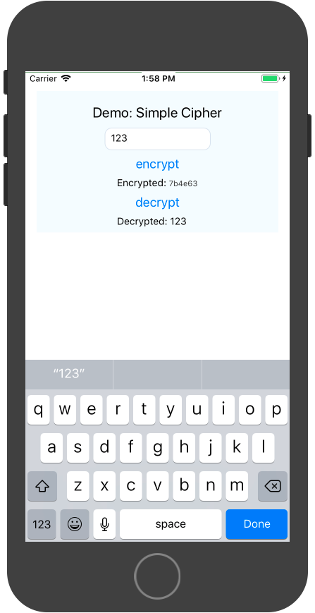
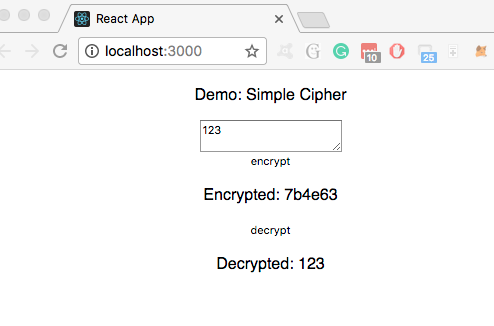

# universal-cipher
 
Simpler way to share core logic across react, react-native and node env with yarn workspaces.

## Introduction
With the introduction of yarn [nohoist](https://github.com/yarnpkg/yarn/pull/4979), we can finally eliminate many pain points caused by libraries not compatible with monorepo project's hoisting scheme. While getting started with react and react-native have been greatly simplified (see [react-native examples](../react-native) and [react-cipher](packages/react-cipher)), we all know our applications are far more complicated than these starting points, therefore, we created this example to answer the following questions: 

1. how to host react and react-native packages within the same project?
1. how to handle internal packages dependencies? links? hoist or nohoist?
1. how to share core logic between react and react-native? 
1. how to deploy node.js modules to both browser (react) and mobile (react-native) in yarn workspaces?

What exactly does this example, _"universal cipher"_, do? It basically provide a [AES-GCM](https://en.wikipedia.org/wiki/Galois/Counter_Mode) based encrypt/decrypt function for both browser (with react) and mobile (with react-native). All the encrypt/decrypt function is centralized in the [cipher-core](packages/cipher-core) package, an internal package/workspace, which [react-cipher](packages/react-cipher) (a react app) and [RNCipher](packages/RNCipher) (a react-native app) depend on. The actual encrypt/decrypt functions in cipher-core are based on the node.js [crypto](https://nodejs.org/api/crypto.html) module. Therefore, getting this example to work helped us answer the questions above. 


Please note that there are many ways to achieve the same effect. Here we merely demonstrated one possible configuration that worked reasonably well for us. If you encountered issues not documented, feel free to ask so we can continue to improve and help each other to do great things...

### file structures

There are 3 packages in the workspaces:
```
| universal-cipher (project root)
| -- packages
| ----- react-cipher (cipher for browser with react)
| ----- RNCipher (cipher for ios/android with react-native)
| ----- cipher-core (shared core cipher functions for all platforms above)
```

### environment
  - os: MacOS 10.13.3
  - yarn: 1.4.1-20180211.22367 (1.4.2 pre-release)
  - node: 8.9.1
  - npm: 4.6.1
  - react-native: 0.52.x
  - react: 16.2
  - react-scripts: 1.1.0

## installation
1. follow [react](https://facebook.github.io/react-native/docs/getting-started.html) and [react-native](https://facebook.github.io/react-native/docs/getting-started.html) guide to prepare your environment.
1. clone this repo
1. in project root directory, run `yarn install` 
1. optionally, you can run `yarn test` in each package to check installation
    - _note: react-cipher test will probably fail, see [known issues](#known-issues)  below_

## run

### RNCipher
to run it in ios simulator:
```
$ cd packages/RNCipher
$ react-native run-ios
```

or android emulator:
```
$ cd packages/RNCipher
$ react-native run-android
```
you should see the simple Cipher started in your simulator:




### react-cipher
to run it in the browser:
```
$ cd packages/react-cipher
$ yarn start
```
you should see the simple Cipher started in your browser:



## behind the scene

### how we created these packages
- **RNCipher**: created with `react-native init`. See [rn-native](../react-native/rn-native) example for detail.
- **react-cipher**: created with [create-react-app](https://github.com/facebook/create-react-app). Just make sure you have the "react-cipher/react-scripts" in the nohoist list (see package.json config #3 below), everything should just work. 
- **cipher-core**: just a typical package, all of its dependencies are hoisted to the project root following the default workspaces hoist scheme.

### configuration
we will explain a few critical configurations used in the project:

#### workspaces config
Below is the yarn workspaces configure from the [package.json](package.json) under the project's root directory. 
```
  // package.json in project root
  ...
  "workspaces": {
    "packages": ["packages/*"],     
    "nohoist": [
      "**/react-native",            // --- 1
      "**/react-native/**",         // --- 2
      "react-cipher/react-scripts", // --- 3
      "**/cipher-core",             // --- 4
      "RNCipher/react-native-*",    // --- 5
      "RNCipher/react-native-*/**", // --- 6
      "RNCipher/vm-browserify",     // --- 7
      "RNCipher/vm-browserify/**"   // --- 8
    ]
  },
  ...
``` 

- **1**: this tells yarn not to hoist react-native module for _any_ workspace package referencing it. This is mainly for react-native app, we could also replace the wildcard "**" with explicit package name like RNCipher.
- **2**: this tells yarn not to hoist any of the react-native's dependent modules. This is for RNCipher.
- **3**: this tells yarn not to hoist react-scripts under workspace react-cipher. This is to bypass create-react-app problem under monorepo project as of today (1/31/2018).
- **4**: this tells yarn not to hoist cipher-core for any workspace referencing it. Both react-ciper and RNCipher depends on cipher-core. yarn will create a symlink to the actual cipher-core under each package's node_modules.
- **5 - 8**: these tell yarn not to hoist any module and their dependencies with name "vm-borwserify" or prefixed with "react-native-" under RNCipher workspace. These modules are react-native adapted node modules, which will be bundled by react-native's bundler `metro`. 

General introduction of nohoist can be found [here](https://yarnpkg.com/blog/2018/02/15/nohoist/d). 

#### react-native node module mapping 
Handling node modules in react-native turns out to be quite a challenge, even more than hoisting ;-). Fortunately, now have more options, like nohoist, to work around these problems.

The node modules of course do not exist in mobile environment, fortunately most of them have already been adapted for browser or react-native. Usually react-native can use the browserified module, but some computation intensive libraries might have been further optimized to take advantage of the native code, such as [react-native-randombytes](https://github.com/mvayngrib/react-native-randombytes). Therefore, we need to do 3 things to instruct react-native's package bundler, [metro](https://github.com/facebook/metro) where to find the adapted module and native code. 

1. **module mapping**
  By specifying the _"extraNodeModules"_ in [rn-cli.config.js](packages/RNCipher/rn-cli.config.js), we provided the explicit module map for the adapted node modules, so metro can find and bundle them effectively:
    ```
      var config = {
        extraNodeModules: {
          crypto: path.resolve(cwd, "./node_modules/react-native-crypto"),
          stream: path.resolve(cwd, "./node_modules/react-native-stream"),
          randombytes: path.resolve(cwd, "./node_modules/react-native-randombytes"),
          vm: path.resolve(cwd, "./node_modules/vm-browserify")
        }
      };
    ``` 
    Note these modules are located directly under RNCipher/node_modules because they are also in the nohoist list mentioned above. 

2. **native code linking**
  In order to use the native code, we will need to tell android/ios build system to link them into the binary. Fortunately react-native already provided a [link](https://facebook.github.io/react-native/docs/linking-libraries-ios.html) command that does most of the tedious work for us. We just need to add a postinstall script in RNCipher's [package.json](packages/RNCipher/package.json) to automatically linking them upon module changes:
    ```
      "postinstall": react-native link 
    ```
3. **global shimming**
    We know that some node libraries expect common global variables, such as Buffer and process. In addition, the crypto library dependency [pbkdf2](), raised exception for `process.version.split` because the process module doesn't have the "version" property. Therefore we created a simple [global-shim.js](packages/RNCipher/global-shim.js) to patch up some global assumptions, including assigning a "version" to the global process if not found. This file needs to be included as early as possible, thus in [index.js](https://github.com/connectdotz/yarn-nohoist-examples/blob/master/workspaces-examples/universal-cipher/packages/RNCipher/index.js) 

4. **multi roots**
    When you start to add additional modules, some of them might get hoisted to the root and you might start to see the following error message from Metro when starting the app (see issue #4):

    ```
    Metro Bundler ready.

    Loading dependency graph, done.
    error: bundling failed: Error: Unable to resolve module `react-redux` from `/Users/cmcewen/code/yarn-nohoist-examples/workspaces-examples/universal-cipher/packages/RNCipher/App.js`: Module does not exist in the module map or in these directories:
    /Users/cmcewen/code/yarn-nohoist-examples/workspaces-examples/universal-cipher/node_modules
    ```

    you can help metro bundler to find your modules by providing the additional search directories via `getProjectRoots()` in [rn-cli.config.js](packages/RNCipher/rn-cli.config.js). 
    
##### alternatives
We have also explored the following popular alternatives for resolving node module compatibility: 

1. [rn-nodeify](https://github.com/mvayngrib/rn-nodeify)

    this tool "hack" the modules in _cwd_/node_modules to add known browserified module map and perform some "inline fixes", such as the one in pbkdf2 mentioned above. It called this process "hacking" for good reason: the script modifies (via pattern match-and-replace) the 3rd-party libraries locally (in RNCipher/node_module) after installation. One obvious problem in workspaces env is that not all modules are under current package; the second issue is potential code corruption when the 3rd-party library changed before rn-nodeify can modify the hacking script. A pattern based code modification is dangerous, to say the least. 

    Even though we choose not to use the rn-nodefy directly, I must give the module author lots of credit for figuring out the common compatibility problem and how they can be addressed for RN, the [pkg-hacks.js](https://github.com/mvayngrib/rn-nodeify/blob/master/pkg-hacks.js) is a great resource. The [shim.js]() also provided a good baseline for our own global-shim.js. Thanks rn-nodeify!

1. [ReactNativify](https://github.com/philikon/ReactNativify)

    ReactNativify used another approach via react-native config (rn-cli.config.js) to "transform" the require() calls in order to map node modules to the adapted modules. It provided an example [transformer.js](https://github.com/philikon/ReactNativify/blob/master/transformer.js) based on  [babel-plugin-rewrite-require](https://www.npmjs.com/package/babel-plugin-rewrite-require) and webpack's [node-libs-browser](https://github.com/webpack/node-libs-browser) package. 
    
      This is definitely less "hacky" than rn-nodiify and probably will work just fine, but we eventually decided to adopt a simpler, declarative approach: **extraNodeModules** in rn-cli.config.js, which does exactly what the transformer do but with declarative syntax.
    
## Known Issues

### RNCipher: - No bundle url present
this is a [known issue](https://github.com/facebook/react-native/issues/12754), rerun the react-native while keeping the packager running usually fixes it.

### react-cipher test failed 
  You will most likely see the following error if you run yarn test in react-cipher: 
  > SyntaxError: Unexpected token export

  this is because the default [jest config](https://github.com/facebook/create-react-app/blob/next/packages/react-scripts/scripts/utils/createJestConfig.js) (by [create-react-app](https://github.com/facebook/create-react-app)) will not transpile any lib in node_modules. Therefore, cipher-core, an es6 module, failed in `yarn test`. 

  There are multiple ways to fix it:
  1. **transpile the cipher-core ourselves**, which is what react-native recommended. You can find the webpack.config.js in the cipher-core package that does exactly that. _So why didn't we distribute the transpiled version?_ 
  
      In reality, we are going to use many other 3rd party libraries that we have no control over its distribution mechanisms and, not surprisingly, one of the most challenging issues in many react/react-native projects. Therefore, we decided to simulate this use case and not transpile our own "cipher-core".

  1. **let jest transpile cipher-core**. react-scripts transpile the dependencies through webpack but didn't perform the same for jest. IMHO, this is a discrepancy worth to address, such as allowing developers to override the `transformIgnorePatterns` so we can bring the transpile policy to parity. Until this is addressed, you can either eject the app or directly modify the `createJestConfig.js` in react-cipher/node_modules/react-scripts/scripts/utils (note your change will be lost when node_modules changes): replace `transformIgnorePatterns` with something like this:
      ```
      transformIgnorePatterns: [
        "universal-cipher/node_modules", 
        "node_modules/?!(cipher-core)"
      ],
      ``` 

      _Why didn't we just eject the app and fix the test error?_ 

      To eject the app just for a rather minor jest config change didn't feel right. We were hoping to convince CRA to adopt `transformIgnorePatterns` customization, therefore leave this package to demonstrate the use case.

## TODO
- [ ] follow up with create-react-app for jest test failure fix (customizing "transformIgnorePatterns")